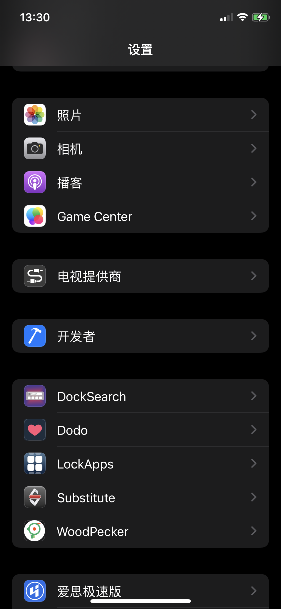
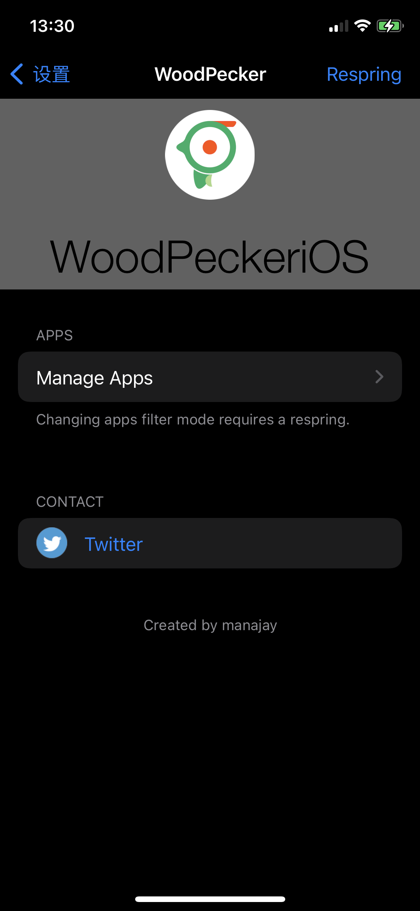
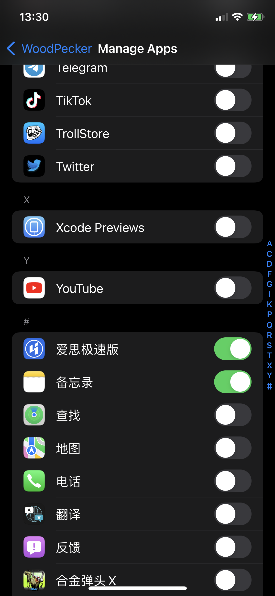
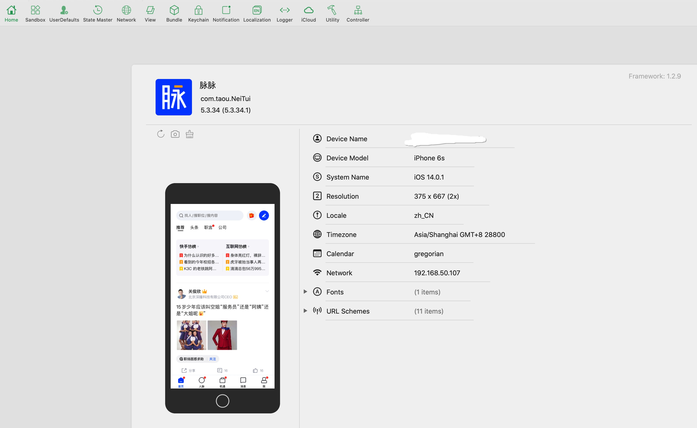

# Lookin Loader Tweak

关于 Lookin 可以参考[项目主页](https://lookin.work/)。
本插件可以在越狱设备上动态加载 LookinServer.framework 到任意应用中，以使用 LookinServer 进行应用内调试UI。

## 安装
- 配置好本地的 thoes 环境 详情查看 [theos-installation-macos](https://theos.dev/docs/installation-macos)
  - 注意配置好环境变量 `${THEOS}` 以及 对应的 iPhone SDK 是否在 theos 的 SDK 文件夹中
- 将本项目 clone 到本地，修改 Makefile 中的设备 IP 和 PORT，然后执行 `make package install` 即可。
  - 如果想自动安装到手机
  - 配置好 ssh 
  - USB 连接越狱设备: `iproxy 2222 22`
  - 到 `make do`
  - 然后 生成 deb 文件, 就可以安装到 iOS 设备上

## 使用

打开设置页, 找到 LookinLoader，进入 Manage Apps, 选择要你想要调试的程序, 打开开关。




启动对应的应用，查看 Mac 端的 Lookin 是否显示应用首页,
如果还不出现, 大概率是iOS14 之后的App, 需要本地网络访问权限开关
解决:
- 在 Privacy - Local Network Usage Description 添加本地网络使用描述
- 在 Bonjour services 列表添加 _adhp._tcp

## 效果




## issue
收集一下遇到的问题
1. 动态库签名问题导致加载  LookinLoader.framework 加载失败

可查看相应签名

```
codesign -d -vv ./LookinLoaderPrefs/layout/Library/Application\ Support/LookinLoader/LookinServer.framework
```

解决办法:重签名

```
codesign -fs "Apple Development: xxxx" ./LookinLoaderPrefs/layout/Library/Application\ Support/LookinLoader/LookinServer.framework
```